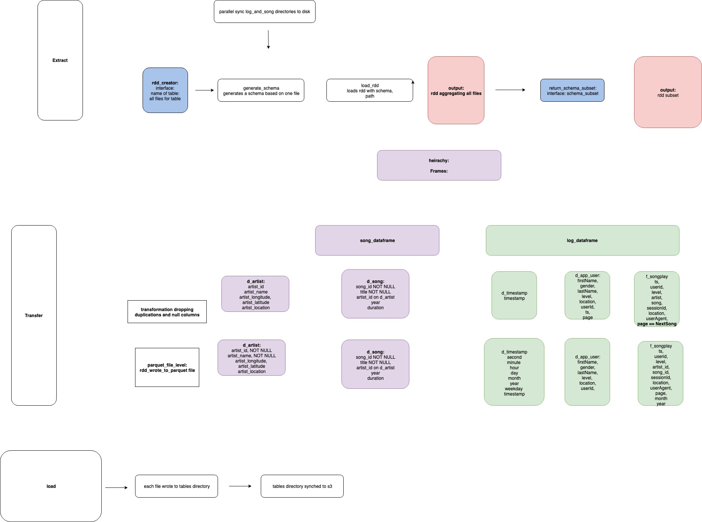
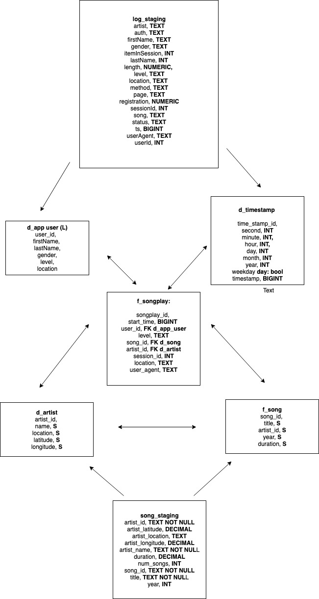

### SPARKIFY ETL 
#### Pipeline to fetch json files from s3, aggregate them using EMR then sync them to S3

#### Project Overview

Music company sparkify generate JSON logs that cover how songs are played in their app. This dataset is joined with an open source songs and artist JSON collection so data analysts can identify trends in song plays. 

#### App Architecture

#### Database Schema 

#### Setup

* Create an EMR cluster 
* SSH onto the cluster
* Create a virtualenv on the master node of the cluster with all the dependencies for the app installed (dependencies in requirements.txt)
* Copy the etl.py & lib directories to the master node 
* Run spark-submit etl.py to invoke the job

#### Additional Steps

* Performance testing, ideally with a bigger and more complex dataset to identify bottlenecks
* Developing unit tests alongside code to make code more production ready and increase documentation
* Review schema optimization and how indexes could be best used to increase speed on the fact table
* Review how to efficiently update on conflict/existing rows and columns

